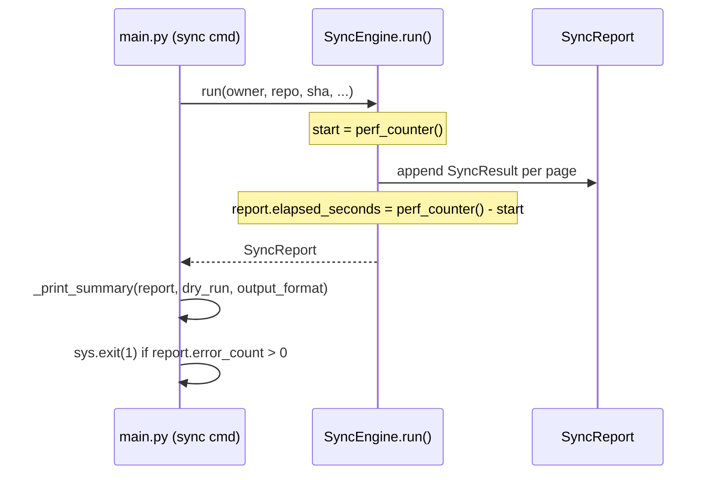

# Architecture — TC-003: Sync Summary Report

## Overview

US-003 enhances the existing `docsync sync` command to emit a structured summary report after each run.  The codebase already contains `SyncResult`, `SyncReport`, `SyncStatus`, and `SyncEngine`; this feature extends those artefacts rather than replacing them.

**Design goals:**
1. Surface per-action counts (created / updated / archived / skipped / errors) and elapsed time.
2. Keep the existing `SyncResult` / `SyncReport` dataclasses as the single source of truth.
3. Add an optional `--output-format json` flag for machine-readable output.
4. Exit with code 1 when any errors are present.
5. Zero breaking changes to callers of `sync.run()`.

---

## Existing Components (relevant)

| Component | File | Current Role |
|-----------|------|--------------|
| `SyncStatus` enum | `src/docsync/sync.py` | Labels each page result: CREATED / UPDATED / ARCHIVED / SKIPPED / FAILED |
| `SyncResult` dataclass | `src/docsync/sync.py` | Per-page result record |
| `SyncReport` dataclass | `src/docsync/sync.py` | Aggregates all `SyncResult`s; has `success_count`, `skip_count`, `failure_count` |
| `SyncEngine.run()` | `src/docsync/sync.py` | Returns `SyncReport` |
| `sync` CLI command | `src/docsync/main.py` | Calls `engine.run()`, prints one-line summary, exits 1 on failure |

---

## Changes Required

### 1. `SyncReport` — add per-action counters and elapsed time

Add computed properties to `SyncReport`:

```python
@property
def created_count(self) -> int: ...   # SyncStatus.CREATED

@property
def updated_count(self) -> int: ...   # SyncStatus.UPDATED

@property
def archived_count(self) -> int: ...  # SyncStatus.ARCHIVED

@property
def skipped_count(self) -> int: ...   # SyncStatus.SKIPPED  (replaces skip_count)

@property
def error_count(self) -> int: ...     # SyncStatus.FAILED   (replaces failure_count)
```

Add a mutable field:
```python
elapsed_seconds: float = 0.0
```

Keep existing `success_count`, `skip_count`, `failure_count` as aliases to avoid breaking callers.

Add a new method:
```python
def summary_dict(self) -> dict:
    """Return summary as a plain dict (used for JSON output)."""
    return {
        "created": self.created_count,
        "updated": self.updated_count,
        "archived": self.archived_count,
        "skipped": self.skipped_count,
        "errors": self.error_count,
        "elapsed_seconds": round(self.elapsed_seconds, 2),
    }
```

### 2. `SyncEngine.run()` — capture elapsed time

Wrap `asyncio.run(self._run_async(...))` with `time.perf_counter()` and store into `report.elapsed_seconds`.

### 3. `sync` CLI command (`main.py`) — replace one-liner with full summary

Add a new `--output-format` option:
```python
@click.option(
    "--output-format",
    "output_format",
    type=click.Choice(["table", "json"]),
    default="table",
    show_default=True,
    help="Summary output format: table (default) or json",
)
```

Replace the current one-line `click.echo(f"[docsync] Done — ...")` with a call to a new helper `_print_summary(report, dry_run, output_format)`.

### 4. New helper `_print_summary()` in `main.py`

```python
def _print_summary(report: SyncReport, dry_run: bool, output_format: str) -> None:
    if output_format == "json":
        import json
        print(json.dumps(report.summary_dict()), flush=True)
    else:
        label = "DRY-RUN SUMMARY" if dry_run else "SYNC SUMMARY"
        log.info(
            label,
            created=report.created_count,
            updated=report.updated_count,
            archived=report.archived_count,
            skipped=report.skipped_count,
            errors=report.error_count,
            elapsed_seconds=round(report.elapsed_seconds, 2),
        )
        # Human-readable table to stdout
        click.echo(f"\n[docsync] {'DRY RUN ' if dry_run else ''}SUMMARY")
        click.echo(f"  Created:  {report.created_count}")
        click.echo(f"  Updated:  {report.updated_count}")
        click.echo(f"  Archived: {report.archived_count}")
        click.echo(f"  Skipped:  {report.skipped_count}")
        click.echo(f"  Errors:   {report.error_count}")
        click.echo(f"  Elapsed:  {report.elapsed_seconds:.2f}s")
```

---

## Data Flow



---

## Interface Contracts

### `SyncReport.summary_dict()` → `dict`
```json
{
  "created": 3,
  "updated": 1,
  "archived": 0,
  "skipped": 2,
  "errors": 0,
  "elapsed_seconds": 1.43
}
```

### `--output-format json` stdout
Single line: `{"created":3,"updated":1,"archived":0,"skipped":2,"errors":0,"elapsed_seconds":1.43}\n`

### Exit codes
| Condition | Exit code |
|-----------|-----------|
| All pages processed, 0 errors | 0 |
| Any page has `SyncStatus.FAILED` | 1 |
| Pre-flight / config error (existing) | 1 |

---

## Error Handling Strategy

- Pages that raise exceptions during Confluence calls receive `SyncStatus.FAILED`; the error message is stored in `SyncResult.error`.
- The error count is always displayed in the summary — never silenced.
- If `--output-format json` is used and serialisation fails for any reason, fall back to the table format and log a `structlog` warning.

---

## Security Considerations

- `SyncResult.error` may contain HTTP response details; ensure `ConfluenceClient` already sanitises tokens from exception messages (DD-05 from design review).
- The JSON summary dict contains only numeric counts and elapsed time — no credentials or file content.

---

## Technology Choices

| Concern | Choice | Rationale |
|---------|--------|-----------|
| Elapsed time | `time.perf_counter()` | Monotonic, sub-millisecond precision, stdlib |
| JSON output | stdlib `json.dumps()` | No new dependency |
| Human output | `click.echo()` + `structlog` | Consistent with existing codebase |
| Format flag | `click.Choice(["table","json"])` | Self-documenting, validates input |

---

## Directory Layout (changed files only)

```
src/docsync/
  sync.py     ← add elapsed_seconds field + per-action properties + summary_dict()
  main.py     ← add --output-format flag + _print_summary() helper
tests/
  test_sync.py          ← add tests for new SyncReport properties + summary_dict()
  test_sync_summary.py  ← new: CLI integration tests for summary output
```
